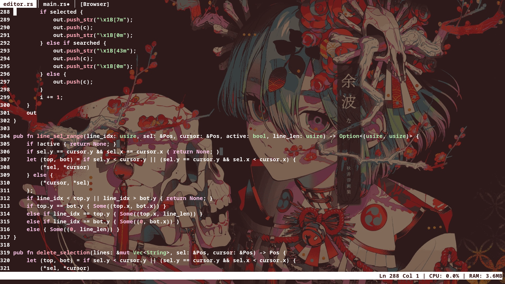

# edit — terminal text editor in Rust

A modal terminal text editor built on raw ANSI escape sequences, written in Rust. Supports syntax highlighting, tabs, file browser, themes, auto-completion, and Vim‑like command mode.


## Features

- Syntax highlighting: keywords, strings, numbers, comments (`//`, `/* */`), block strings (`"""`), attributes (`#[...]`)
- Multiple open files via tabs + built-in file browser
- Search with match counter (`Ctrl+F`, navigate with Up/Down)
- Undo / redo history (Ctrl+Z / Ctrl+Y)
- Clipboard: copy, cut, paste (with system clipboard via `xclip`/`wl-copy`/`xsel`)
- Mouse support: click to position cursor, scroll wheel
- Auto-completion (Ctrl+M)
- Bracket pair insertion (`(`, `[`, `{`, `"`, `'`)
- Configurable key bindings and tab width
- Themes (create/edit with `:mktheme` / `:edtheme`)
- Dynamic line numbers, line selection with Shift+arrows
- Tab reordering (Ctrl+Up, then Ctrl+←/→)
- System info display (CPU/RAM)
- Auto-reload files on external change
- Command history (Up/Down in command mode)

## Installation

Requires Rust 1.70+:

```bash
# Build
git clone <repo> && cd editor
cargo build --release

# Install to PATH
cp target/release/edit ~/.cargo/bin/
```

## Usage

```bash
edit <file>           # Open file
edit                  # Start with empty buffer
edit dir/             # Start with file browser in dir
```

## Keybindings

| Key | Action |
|-----|--------|
| `Ctrl+Q` | Quit |
| `Ctrl+S` | Save |
| `Ctrl+Z` | Undo |
| `Ctrl+Y` | Redo |
| `Ctrl+F` | Search |
| `Ctrl+C` | Copy selection |
| `Ctrl+X` | Cut selection |
| `Ctrl+V` | Paste |
| `Ctrl+A` | Select all |
| `Ctrl+D` | Delete line |
| `Ctrl+K` | Clear buffer |
| `Ctrl+N` | File browser |
| `Ctrl+W` | Close tab |
| `Ctrl+L` | Toggle system info |
| `Ctrl+M` | Toggle auto-completion |
| `Ctrl+Home` | Go to file start |
| `Ctrl+End` | Go to file end |
| `Ctrl+Backspace` | Delete word |
| `Ctrl+Shift+W` | Save and quit |
| `Ctrl+Up` | Toggle reorder mode |
| `Alt+Left` | Browser: go back |
| `Shift+←/→/↑/↓` | Select text |
| `Home` / `End` | Line start / end |
| `PageUp` / `PageDown` | Page up / down |
| `Delete` | Delete character at cursor |
| `Tab` / `Shift+Tab` | Next / previous tab |
| `Esc` | Enter command mode |

### File browser

| Key | Action |
|-----|--------|
| `↑` / `↓` | Navigate |
| `Enter` on `..` | Parent directory |
| `Enter` on directory | Enter directory |
| `Enter` on file | Open file |
| `Enter` on `[New file]` | Create new file |
| `r` | Rename selected entry |
| `Delete` | Delete selected entry |
| `Alt+Left` | Go back in history |
| `Ctrl+N` | Open browser (or switch to it) |
| `Ctrl+W` | Close browser tab |

### Command mode (`Esc`)

| Command | Action |
|---------|--------|
| `:q` | Quit |
| `:w` | Save |
| `:wq` | Save and quit |
| `:numlist` | Toggle line numbers |
| `:sysinfo` | Toggle system info |
| `:set <key> <value>` | Set config option |
| `:theme <name>` | Apply theme |
| `:mktheme <name>` | Create / edit theme |
| `:edtheme <name>` | Open theme for editing |
| `:help` | Show help with current bindings |
| `:<number>` | Go to line |

### Search mode (`Ctrl+F`)

| Key | Action |
|-----|--------|
| `Up` | Previous match |
| `Down` | Next match |
| `Esc` | Cancel search |
| `Enter` | Confirm and exit search |

## Configuration

Settings are stored in `~/.config/edit/config` (key = value format):

```
show_numbers = true
tab_width = 4
theme = default
```

Key bindings can be remapped:

```
:set bind_save Ctrl+S
:set bind_quit Ctrl+Q
:set bind_undo Ctrl+Z
```

Available `:set` options: `show_numbers` (bool), `tab_width` (1+), `theme` (name), `bind_<action>` (key combo).
